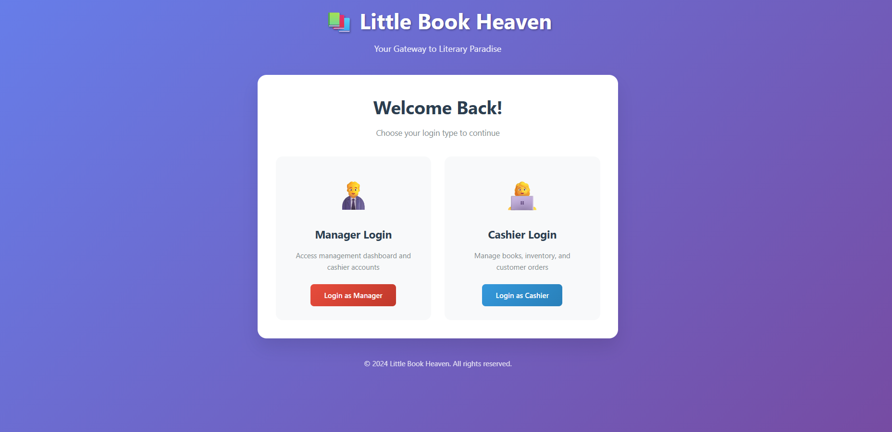
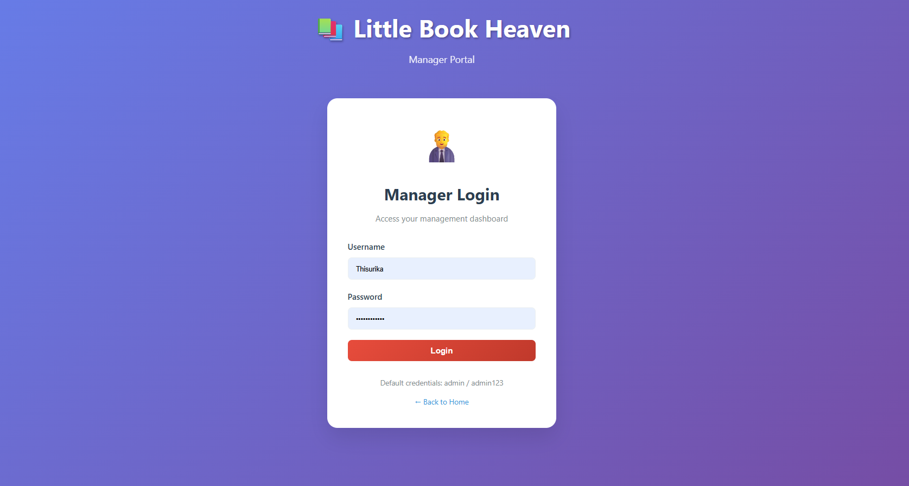
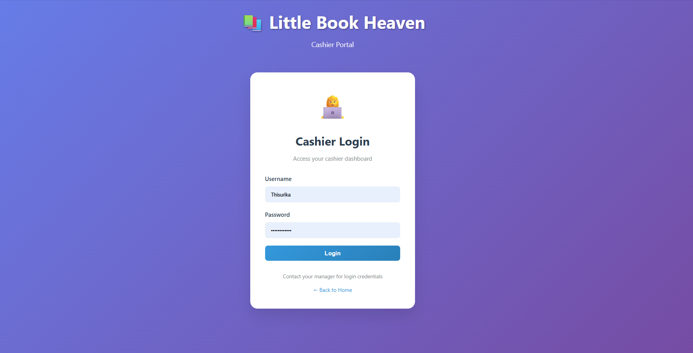
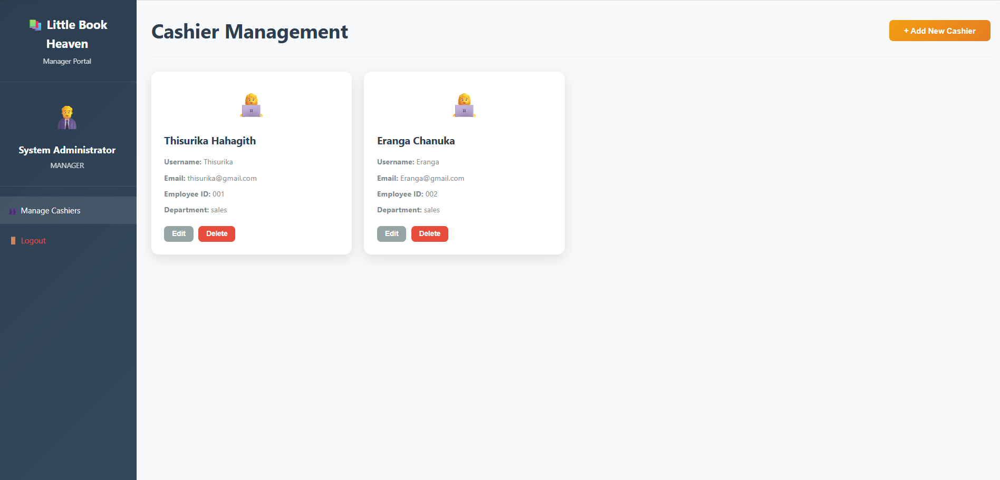
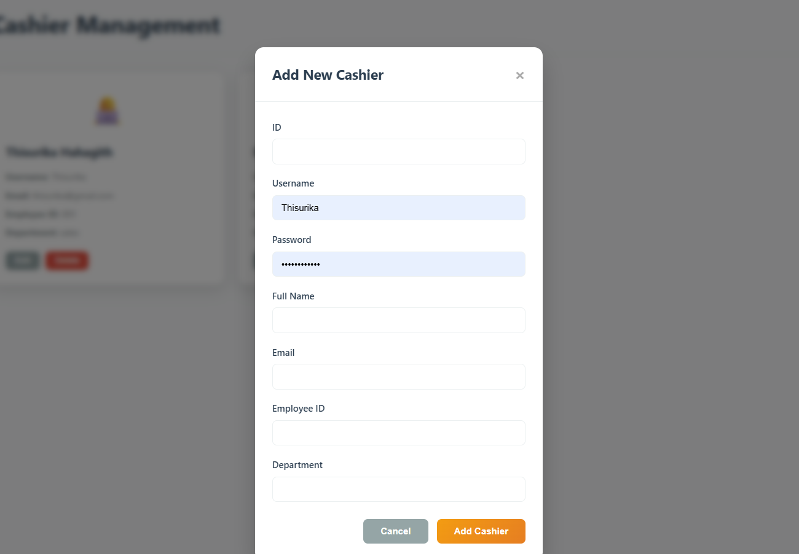
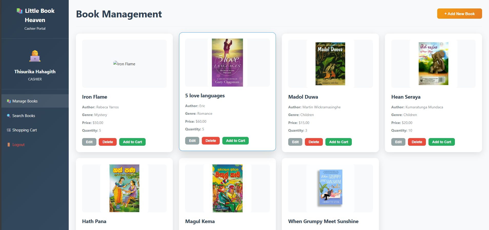
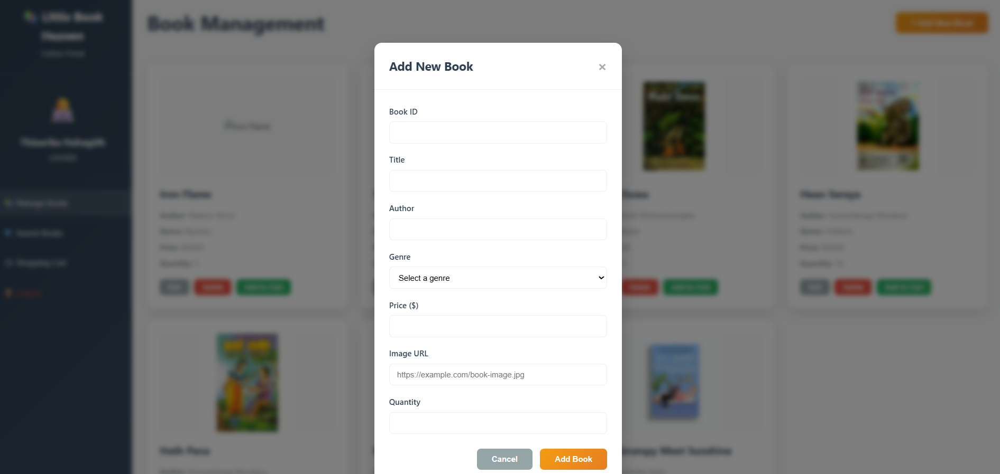
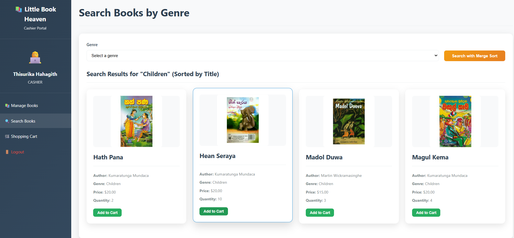
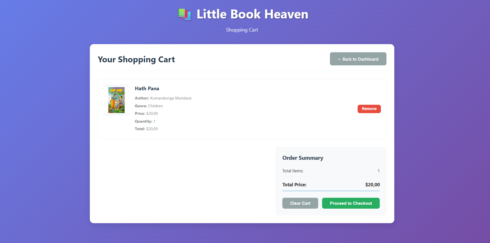

# Little Book Heaven – Bookstore Management System

**Little Book Heaven** is a Java EE-based web application designed to manage a bookstore system with role-based access. Developed as part of my undergraduate studies at SLIIT, this project demonstrates strong use of Object-Oriented Programming, File Handling, and Data Structures (Merge Sort and Binary Search Tree).

---

## 🔧 Features

- **User Roles:**
  - 👤 **Manager**: Add and manage cashiers.
  - 👤 **Cashier**: Add, view, update, delete books; manage cart and search.

- **Book Management:**
  - Perform CRUD operations on books.
  - Store book data in text files using `FileHandler.java`.

- **Cart & Payment:**
  - Add books to cart, calculate total bill.

- **Search & Sort:**
  - Filter books by category using **Merge Sort**.
  - Store books in a **Binary Search Tree** for optimized search.

- **Frontend:**
  - Built with JSP, HTML, and CSS for a user-friendly interface.

---

## 🛠️ Tech Stack

| Technology    | Description                        |
|---------------|------------------------------------|
| Java EE       | Backend logic (Servlets, JSP)      |
| JSP/CSS/HTML  | Frontend views                     |
| Apache Tomcat | Deployment server (v10.1.x)        |
| File I/O      | Data persistence (no DB)           |
| Maven         | Build tool                         |
| DSA Used      | Merge Sort, Binary Search Tree     |

---

## 🗂️ Project Structure

project/
├── src/

│ ├── model/ # Book, Cashier classes (OOP)
│ ├── dao/ # FileHandler, BookDAO
│ └── servlet/ # Servlet classes
├── web/ # JSP, CSS, images
├── WEB-INF/ # web.xml
├── pom.xml
└── README.md # This file

---

## 🚀 Getting Started

1. **Clone the repository**  
   ```bash
   git clone https://github.com/your-username/LittleBookHaven.git
Import into IntelliJ or VS Code (with Java & Maven support)

Build the project

bash
Copy
Edit
mvn clean install
Run with Apache Tomcat 10.1.x
Deploy WAR file or run directly via IDE

Access via browser

arduino
Copy
Edit
http://localhost:8080/LittleBookHaven/
📦 System Requirements
Java JDK 17+

Apache Tomcat 10.1.x

Maven 3+

Web browser

🧑‍💻 Author
Thisurrika
SLIIT Undergraduate – BSc (Hons) in Information Technology specialization in data science
📧 Email: donthisurika@gmail.com

📜 License
This project is open-source and free to use for educational purposes.

“First, solve the problem. Then, write the code.” – John Johnson

## 🖼️ Screenshots

### 🔐 1. Home Page – Role Selection


### 🔑 2. Manager Login Page


### 🔑 3. Cashier Login Page


### 📊 4. Manager Dashboard


### 👥 5. Add Cashier Form


### 💼 6. Cashier Dashboard


### ➕ 7. Add Book Form


### 🔍 8. Search Books by Genre (Merge Sort)


### 🛒 9. Shopping Cart & Total Payment



